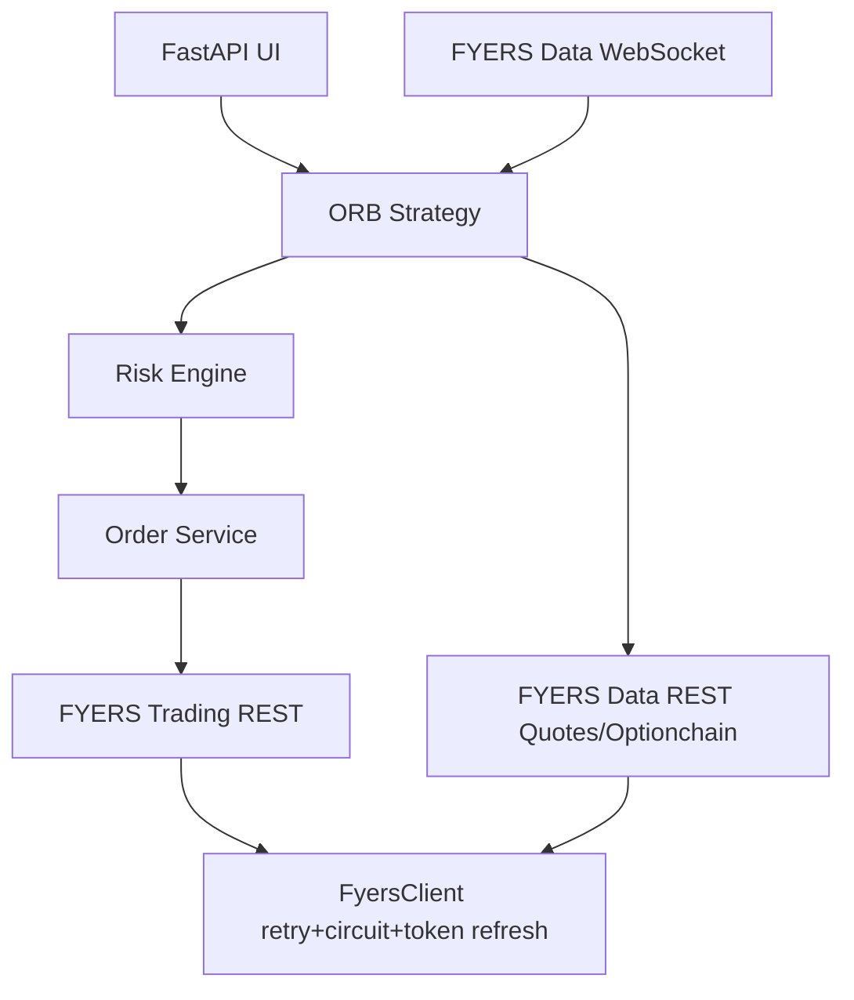

# Lords Bot

Production-grade FastAPI + async Python trading bot for NIFTY50 options using an ORB breakout strategy and FYERS APIs.

## Architecture



## Installation

1. Create venv and install dependencies.
2. Copy `.env.example` to `.env` and fill values.
3. Run `python -m lords_bot.main`.

## Configuration (.env)

- `FYERS_APP_ID`, `FYERS_SECRET`, `FYERS_PIN`: broker credentials.
- `FYERS_BASE_URL`: trading API base URL.
- `FYERS_DATA_URL`: market data base URL.
- `TRADING_MODE`: `PAPER` or `LIVE`.
- `INITIAL_CAPITAL`, `STOP_LOSS_PCT`, `TARGET_PCT`: risk defaults.
- `LOG_LEVEL`, `LOG_FILE`: logging configuration.

## FYERS API Endpoints

### A) Authentication

1. **GET /authcode**
   - URL: `https://api-t1.fyers.in/api/v3/generate-authcode`
   - Purpose: Start auth-code flow.
   - Example request:
     ```http
     GET /api/v3/generate-authcode?client_id=APP&redirect_uri=http://127.0.0.1:8080&response_type=code
     ```
   - Example response snippet: redirect URI with `auth_code=...`.

2. **POST /api/v3/token**
   - URL: `https://api-t1.fyers.in/api/v3/token`
   - Purpose: exchange auth code for access token.
   - Example request:
     ```json
     {"grant_type":"authorization_code","appIdHash":"...","code":"..."}
     ```
   - Example response:
     ```json
     {"s":"ok","access_token":"...","refresh_token":"..."}
     ```

3. **POST /api/v3/token/refresh**
   - URL: `https://api-t1.fyers.in/api/v3/token/refresh`
   - Purpose: refresh expired tokens without full login.
   - Example request:
     ```json
     {"grant_type":"refresh_token","refresh_token":"..."}
     ```
   - Example response:
     ```json
     {"s":"ok","access_token":"new-token"}
     ```

### B) Trading Orders

- **GET/POST/PUT/DELETE /api/v3/orders**
  - URL: `${FYERS_BASE_URL}/orders`
  - Purpose: list/create/modify/cancel orders.
  - Example POST request:
    ```json
    {"symbol":"NSE:NIFTY24OCT23000CE","qty":75,"type":2,"side":1,"productType":"INTRADAY"}
    ```
  - Example response:
    ```json
    {"s":"ok","id":"24010100000001"}
    ```

- **GET /api/v3/orders/sync**
  - URL: `${FYERS_BASE_URL}/orders/sync`
  - Purpose: sync order state quickly after placement.

- **GET /api/v3/positions**
  - URL: `${FYERS_BASE_URL}/positions`
  - Purpose: startup/open-position reconciliation.

- **GET /api/v3/trades**
  - URL: `${FYERS_BASE_URL}/trades`
  - Purpose: trade book and fill references.

- **POST /api/v3/exit_positions**
  - URL: `${FYERS_BASE_URL}/exit_positions`
  - Purpose: broker-side square-off when required.

### C) Market Data

- **GET /data-rest/v3/quotes**
  - URL: `${FYERS_DATA_URL}/quotes`
  - Purpose: live LTP fallback and trade monitoring.

- **GET /data-rest/v3/history** *(historical only)*
  - URL: `${FYERS_DATA_URL}/history`
  - Purpose: backfill/analytics, not high-frequency live ORB triggers.

- **GET /data-rest/v3/optionchain**
  - URL: `${FYERS_DATA_URL}/optionchain`
  - Purpose: ATM strike selection.

- **GET /data-rest/v3/symbol_master**
  - URL: `${FYERS_DATA_URL}/symbol_master`
  - Purpose: instrument metadata.

- **GET /data-rest/v3/market_depth**
  - URL: `${FYERS_DATA_URL}/market_depth`
  - Purpose: depth-based diagnostics.

### D) WebSocket Endpoints

- `wss://api.fyers.in/socket/v2/data/` - live price ticks.
- `wss://api.fyers.in/socket/v2/order/` - order updates.
- `wss://api.fyers.in/socket/v2/position/` - position updates.
- `wss://api.fyers.in/socket/v2/trade/` - trade executions.

## Why history API fails during live markets and how this bot avoids it

`/history` is meant for historical bars and can throttle or fail (e.g., 503) during peak load if called repeatedly. Lords Bot builds ORB from websocket ticks (09:15-09:30 IST) and uses `/quotes` fallback only when needed. This avoids aggressive history polling and improves broker stability.

## Running the bot

```bash
python -m lords_bot.main
```

UI endpoints:
- `POST /scan`
- `POST /approve`
- `GET /monitor`

## Risk controls

- Max daily loss lockout.
- Max trades/day lockout.
- Risk-based position sizing.
- Circuit breaker on repeated API failures.

## Testing

```bash
pytest -q
```

## Troubleshooting

- **401 errors**: ensure refresh token exists and credentials are valid.
- **503 errors**: check broker availability; client retries then opens circuit.
- **UI missing data**: monitor/scan now return safe default payloads.

## FAQ

**Q: Does this bot auto-refresh token?**
A: Yes, on 401 it refreshes once and retries.

**Q: Does it trade when risk limits are hit?**
A: No. Risk engine blocks further trades and sets shutdown state.
